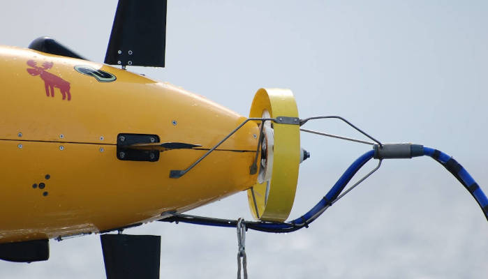

# Open Ocean Software Community Day UK: 4 September 2026 

Do you **develop**, **maintain** or **use** **open source software** (OSS) on your AUVs, ASVs, ROVs, etc.?

Open Ocean Software would like to invite you to our **first community day** at the National Oceanography Centre in Southampton, UK, where you can expect **focused talks**, **in-depth discussions**, and plenty of time for **networking** in a single-track format. This is also your chance to have **early feedback** on the goals and implementation of the Open Ocean Software organization.

**Open Ocean Software** is a new initiative to **support building ecosystems** around OSS for marine robots to improve technical quality, security, maintainability, documentation, interoperability, and to build a vibrant human community around the topic. Open Ocean Software is led by a [team of collaborators](https://oceansoft.org/team/) who have collectively spent decades deploying AUVs in diverse real-world environments running a range of OSS projects. We are currently funded by the US National Science Foundation under the [Pathways to Enable Open-Source Ecosystems (POSE) initiative](https://www.nsf.gov/funding/initiatives/pathways-enable-open-source-ecosystems).

This workshop will take place on **Friday, 4 September 2026**, directly following the [IEEE OES AUV Symposium](https://www.auv2026-southampton.com/), also held in Southampton.

## Call for Presentation Abstracts

**We invite you to submit an abstract for a technical talk** using the link below. These abstracts will be reviewed by the technical committee and accepted talks will be included in one of these tracks:

- **Lightning talk**: A very brief talk intended to introduce the audience to your topic for fruitful discussions later in the day and beyond.
- **Standard talk**: A standard-length conference talk focusing on your development or use of open source in your marine robotics work.

We are interested in a wide range of topics that both include open source software, and applies to marine robots or related technologies: sensors, data acquisition, simulation, and more. 

You do not need to be an author of the OSS project to present how it has been useful (or not) to your application. Also, we are interested in learning from **failures,** **false starts,** and **critiques** as much as successes.

[Submit an abstract](https://docs.google.com/forms/d/e/1FAIpQLSeKM_4OWoI-NgkwtG3wg7mKD3TE-ZCCACcrUPujECtaDRXSeg/viewform?usp=publish-editor){ .md-button .md-button--primary }

## Agenda

A full agenda will be posted after abstract selection. The preliminary schedule is follows:

### Morning session [technical program] (9:00-12:00)

- 9:00-9:15: Open Ocean Software: Introduction
- 9:15-10:00: Technical Session 1: Lightning talk track
- 10:00-10:30: Break (coffee provided)
- 10:30-12:00: Technical Session 2: Standard talk track

### Lunch (12:00-13:30)

Lunch (cost not included) at the NOC cafeteria.

### Afternoon session [community discussion] (13:30-16:30)

- 13:30-14:30: Keynote followed by panel discussion on Open Ocean Software Technical services (interoperability, simulation, DevOps/packaging, etc).
- 14:30-15:00: Break (coffee provided)
- 15:00-16:00: Keynote followed by panel discussion on Open Ocean Software Member project standards (security, documentation, and licensing).
- 16:00-16:10: Wrap-up

**Following the event, all are welcome to continue discussions at a local pub.**

## Registration

Registration fees are inclusive of both coffee breaks but not lunch.

| Category                              | Cost  |
| ------------------------------------- | ----- |
| Early Bird - Regular (before 1 Aug 2026, 11:59 pm BST) | £35   |
| Early Bird - Student/Early Career (before 1 Aug 2026, 11:59 pm BST)     | £20   |
| Regular (after Early Bird deadline)               | £40   |
| Student/Early Career  (after Early Bird deadline) | £25   |

Please register early so we can get accurate attendance numbers to plan accordingly. 

[Register](https://events.humanitix.com/open-ocean-software-community-day-uk-4-september-2026){ .md-button .md-button--primary }

## Key Dates

- **(EXTENDED) 17 July 2026: Abstract deadline**
- 24 July 2026: Authors notified
- 1 August 2026: Early bird registration deadline
- [1-3 September 2026: [IEEE OES AUV 2026](https://www.auv2026-southampton.com/)]
- *4 September 2026: Open Ocean Software Community Day!*

## Want to stay informed?

Would you like to be reminded by email of key updates to this event or notifications for new ones? Subscribe to our **infrequent** email newsletter:

<iframe
  scrolling="no"
  style="width:100%;height:220px;border:1px #ccc solid"
  src="https://buttondown.com/openoceansoftware?as_embed=true"
></iframe>

## Questions?

Email [events@oceansoft.org](mailto:events@oceansoft.org).

