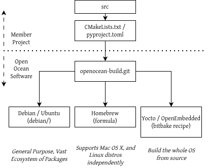

# DevSecOps

We are committed to supporting secure build pipelines for our member projects:



**As this is a work in progress, only MOOS-IvP for Debian/Ubuntu is currently available.**

The configuration for this work is in the [openocean-build](https://github.com/openocean-software/openocean-build/) project.

## Apt Packages

!!! warning "Trust"

    These instructions assume oceansoft.org hasn't been compromised (and thus lists the correct GPG fingerprint: `OOS_KEY`). This is normally a safe assumption, but if your security requirements call for it, consider independently verifying [our signing key](#gpg-signing-public-key), e.g. using Keybase or other out-of-band techniques.

For Debian stable/oldstable and Ubuntu active LTS releases:

- Get the signing key ([details](#gpg-signing-public-key)):
  ```
  OOS_KEY=D7D7224D53A4F29E303FE01DEB505B68A5D063B0
  OOS_KEYRING=/etc/apt/keyrings/oceansoft.gpg
  gpg --keyserver keyserver.ubuntu.com --recv-keys $OOS_KEY && gpg --export $OOS_KEY > $OOS_KEYRING
  ```
- Add `apt` sources:
  ```
  DISTRO=$(. /etc/os-release; echo "$ID")             # "ubuntu" or "debian"
  DIST=$(. /etc/os-release; echo "$VERSION_CODENAME") # e.g., "resolute"
  REPO=http://apt.oceansoft.org/$DISTRO-$DIST/
  echo "deb [signed-by=$OOS_KEYRING] $REPO $DIST main" | sudo tee /etc/apt/sources.list.d/oceansoft.list
  sudo apt update
  ```
- Install packages:
  ```
  apt install ...
  ```

- Full list of packages available:
  ```
  apt install lz4
  lz4cat /var/lib/apt/lists/apt.oceansoft.org*_Packages.lz4
  ```

## GPG signing public key

<a href="https://xkcd.com/1553/"></a>

Currently used to sign Debian/Ubuntu packages posted to http://apt.oceansoft.org.

- User: Toby Schneider ([tsaubergine](https://keybase.io/tsaubergine) on Keybase)
- Fingerprint: `D7D7224D53A4F29E303FE01DEB505B68A5D063B0`
- Keybase: /keybase/public/tsaubergine/openocean-software-signing-pub-key.asc

??? note "Full PGP Public Key"

     ```
     -----BEGIN PGP PUBLIC KEY BLOCK-----
     
     mQINBGphbaUBEADi1aafRKAmd/xVHEEYrD0MXW98vX/riP3oBjRQ9E6Jzz+EIVGA
     qhqsJ++PvaCzkavg918yezPVnpw3/EMyheTsBRlYld5MMa3pF4kd0vEH15pzFulj
     B9WEoLIkhAKdFxquEzsfsIJxT/ZR3A2Fl+EArJVnarU/MWEDEe5DRdDKEyvV1H6n
     +9dq5BxpVXxPSm4m/8qppDdkcxfUtfdMDN9G+OtCHz3fbTi/vinNeh9zv8RsOsGf
     wJT0c4pJO7m9sWKHNZJh0ut1xEfU9+LGCCQ1nU2o7jrUSSLnCOevsfh0sb4LJuHA
     dBD0sPlloQ4Obi3fHBdHuq2AJFp6KUdpiBmz4Z823a7tu1d3+53rS55XK0/UvflH
     RBp9/ez8J3i5/kviD01lS5fIB+SjzcWwpm0Jpps/zqx7P45Udtlz6tFpERJqZIE+
     +oQxD54wtsa1/UFWdh1pzlEPAs10dFkg80cPTgIHvLNev6JpykDtY/An8gnBksDW
     K2VvC4sKhpxAUO8kZpeEfNLxG70fwGuEh7kCbbPcjxjfNje269K1suoofRLzAdQb
     +UWu5IBbB/pLopEorD44t/P5KAUEgePig8GDV4dRdJnz3Ya+gkK4zQwTMODeYHsJ
     VgPVJy7RyF51DPwITStpMeDllgQFp9hsAsMUUVdrHAHv0CJKMDIjbOqCpQARAQAB
     tDlUb2J5IFNjaG5laWRlciAoT3BlbiBPY2VhbiBTb2Z0d2FyZSkgPHRvYnlAb2Nl
     YW5zb2Z0Lm9yZz6JAk4EEwEKADgWIQTq0nj2olZEwsVZ27bSii6rFNKp5QUCamFt
     pQIbAQULCQgHAgYVCgkICwIEFgIDAQIeAQIXgAAKCRDSii6rFNKp5bFCEADOTORb
     ZH17LVK1Yem3UiyuBpzXKsff0dsg1AI7fAirMao6QVOCib7hh+Qh+ZOd/xJB5qTH
     7v8YBYwzrKsyO82WlrU9osU7vJbzXonbUJyI2ov3B9nbvYgaCg52FGuKBoqRRu77
     axK+9+kLdmQJgb5lD4kMce9l0+tVOJj+LO1RPqpsKYyRa0DbmUH0cF0AP6oM467D
     qGhddkZE7HHq+gkx2nMqqIpn3JHTjojQE8hiy4hT/pvB+HwBmnNUlTs3j+p+X9wm
     YnkDx6NEHsYzR8UIqeqpi8RFzDNV6/ZjkEbczMGhdfdTzjT6K7LaS72AnugbVszb
     VQ4IzuAKk2gjbcNxZ+hdmX8qvzNM5hlZDmOEZ3Yjf/PS1W8XEwairgQ9Y/ghzAJM
     rYUF3aAsi+gvXp6uS5vIjx4TbzRvbNPYwbyIaZXQfJVU0Yera+THCvKeeinxSZA+
     CtSHhYPi5rwN2lROBTVs91wagP1vRCiy1F3Xe9KoxlDBNBjojE67w4b5oK+BfuMx
     7beMTS6VwRWtsl3JlEtoJ6cpT2o7qs+bzCKgVvC5ZFjRT53PSs56wlXXYn8lj/nt
     RFT3ROYAH/4TiAfma4yKdm5gY44gPLsum3MxuV4EjTAuHPeG6rzJRk60CMo0mVoY
     a54nmoCZ6eTNZ+dejmWC6i6sscoQmdVr3/5cXLkCDQRqYXcFARAAuE5d3lNDS8Qf
     nRGLiDYLFefoC9nCPRZqp4SjGpf/IuxlAZWScHiE6LCUyF6TDKfpyYZ0MpsjVfxh
     kHIz1SxHCASSTAPzz3L3SB17WP7gqvpiMnjKpETvP5Z8KYPMsG/qQ6shW403VZ2t
     K7ntSzswNZfBwKttV8nJHGjd+1dD1U0z2PxUrVCndTdokDZjaqp8HR1P94DzveRF
     5HvaBbog8sSqXWH+VbZKiVIHmc7u8jq5Lpf4Utde4gk50EJDkGJzjiIupVx4Wq9m
     R+VWh7YFClzUByzyhWFhj2jnh8sbmt9HYpZEKGzHgItQtRvv79f086tR1uEHi/fD
     PX0O+PZgXdYQK5+va9MLa25pr8jFMpxwcppF2viL4kAY2Rz0diSDB0TeRKip5JeD
     ADmvpb1ULjssT1tc93Fd1wG9tcFVJageC6xgOxNXo8wrN57wFF8r5z78XUWgofBi
     7Fr0tBSq0tMWGLAXm/ZB3lAnH9aqf1BkqNQWsq/YZNmLrKsd8vXNzgrQJhrG0JUM
     aT184EQYt5VrXEYRwBKQBHnKxQnoiSPSwBuLLqPgtBBRbK/7c7cCAYjzhGBJ68+X
     8E7SyoWl+L5A6oLvuaOdnBQXLNffMYo9S7GG4wWoZ107TBlUw2N42NLt6N5KbOa4
     DQuGHV0AVNkdn6NQ9pW+SEIZfw9knScAEQEAAYkEcgQYAQoAJhYhBOrSePaiVkTC
     xVnbttKKLqsU0qnlBQJqYXcFAhsCBQkCtsaAAkAJENKKLqsU0qnlwXQgBBkBCgAd
     FiEE19ciTVOk8p4wP+Ad61BbaKXQY7AFAmphdwUACgkQ61BbaKXQY7DPhg/+JDas
     FWQUfxR5i/7s2KUL83GAF8dqmnF5rsb5QuVaBWqELyq+wR7CgycL+z0CUgzQePkb
     WpVoiPNOs2R3YfMPxlWiWr3Mnes8gXUUZpSC8aFjC3tE9HxshqUzPtlMh0OY2NmF
     ptWKSBNWheWsuMWQuSt6W8lOSQzY8xMfiNet+9RECrewFUj7nccINsXaFIElofOT
     ZkLZdeVfcj1QBelQyWPR6DkHJa5IM5a7h3QHbBBn7+jSGVtHTk4u6EbNM7TMe+aU
     oN5dC1+eIufkl5AmhtswWjkVsup7KujFbcPDTa4trJ8FuJOQmgiHBoiY/MYly01z
     dyozOl0GYtWc3zjnCLYnXp04iws7rHCJUzyVa14ZMo8NA77zUZewKUUKMktpaKxQ
     iQUkFfM5bVmAE36/FgFHxDBc902UeDB6pmjWUkJJWOFpEGPi869zQgPVxTLoU0La
     tvSLvHKm9BPD5bfPVYvc4jyD9wQV5O+TNOQfQvc8Li4jt96en/fBIwhdZ0elswIP
     +tHSwT36ZHmww2ZD393V8e187M2MmkINH1s2Y24x3/YAogw3HWt7Ak0/OSH2Tz3M
     Vz0CheE4ooZRQJSyhjLehVE6WNcBwusA4PuZbB8cnlnNlEHr4VY8pW/pYSljij2V
     faLaD75/zRt7YvrXZF+6hEM1ehgAUXj7faKeefPB5xAAzWoqQTpcrYKCsf52bG2U
     fgIfglbH0Ta6VqRWBc71+6XKGEIuxPc4AIFh/CiBpyznzMkQflmxOoerOZTxzBYQ
     QeSkcF5X6NtSCHmvTYrkV3xPGlbBSWN2afs0BUXML8056KuDVTGOZjaEzSdVW1OY
     uFm8QRWEm9VHi8Uw8Cuh3R7YyVIBIiti9D1NEVdi0iStMZiI2DVgPOyoWDSiyWkX
     PUZfJ0Jdb3O/MyiJiHyz/U2HdVQa+YgH/H5yUTwIIsi6qGNXgiiOvmUKd+kt0mRJ
     gW3rKjYpyJCTZRPAS3OkVxywYRzvjSoBPwVeWsxb6nC+VWKkLvTELO9AjPGPBEDL
     84MJpOa0Ga83WDgTYaWskWORdhA9HmHEP9AC1yRLD8y9pfAOUZuozEUN0HL5WKaQ
     xOSZ2i7dIRpLWyzcuhzmZjLBpbGsXFXbp5Xqu8n6UB1worzIB3eqLgtV2uYxranm
     43U/fH/WnstBVMg97OVPuJKepw3oV+oSl/wumv9eZIYgtUXj9AaXnmkP/AnuEa37
     MHQOLTnIEE10WLooExu3DwFrwCGFoZsBDfQ6snlcigduHdHgfeObs7rDGIKzg4Qv
     twSoj87G/f+tRKQXWanxQUnpYtgY9Ol96JQjIUWuVMqDEGKiKUAKyxdKR8c9KF9l
     KMdONYUBMCU2j4li8KdgnQ0=
     =E/xS
     -----END PGP PUBLIC KEY BLOCK-----
     ```